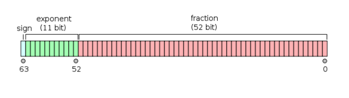
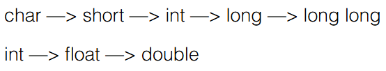

# 第六周：数据类型

## 6.1 数据类型

### 6.1.1

**C是有类型的语言**：
C语言的变量，必须在使用前定义，并且确定类型。
总的来说，早期语言强调类型，面向底层的语言强调类型。
C语言强调类型，但对类型的安全检查并不足够。

**C语言的类型**：
1. 整数
- char
- short
- int
- long
- long long（C99）
2. 浮点数
- float
- double
- long double（C99）
3. 逻辑
- bool（C99）
4. 指针
5. 自定义类型

**类型有何不同**：
1. 类型名称
2. 输入输出时的格式化
- `%d`
- `%ld`
- `%lf`
3. 所表达的数的范围
char<short<int<float<double
4. 内存中所占据的大小
1个字节到16个字节
5. 内存中的表达形式
二进制数（补码）、编码

**sizeof**
- 一个运算符，给出某个类型或变量在内存中所占据的字节数
- `sizeof(int)`
- `sizeof(i)`
- 是静态运算符，结果在编译时决定
- sizeof括号内运算无意义，不会实际执行

### 6.1.2

**整数**
- char:1byte（8bit）
- short:2byte
- int:取决于编译器（CPU），通常意义是“1个字”
- long:取决于编译器（CPU），通常意义是“1个字”
- long long:8byte

### 6.1.3

**整数的内部表达**
计算机内部一切都是二进制
- 18 --> 00010010
- 0 --> 00000000
- -18 --> ？

**二进制负数**

补码：
- 考虑-1。我们希望-1+1-->0，如何做到？
- 0 --> 00000000
- 1 --> 00000001
- 11111111 + 00000000 --> （1）00000000

因为0-1=-1，所以-1=
- （1）00000000 - 00000001 = 11111111

11111111被当作纯二进制被看待时，是255，但被当作补码看待时是-1。
同理，对于-a，其补码为0-a，实际是2^n-a，n是这种类型的位数。
补码的意义：
拿补码和原码可以加出一个溢出的"0"。

### 6.1.4

**数的范围**
对于1byte，可以表达的是：
- 00000000~11111111
- 其中：
- 00000000 --> 0
- 11111111~10000000 --> -1~-128
- 00000001~01111111 --> 1~127

**整数的范围**
- char:1byte:-128~127
- short:2byte:-32768~32767
- int:4byte:`-2^31`~`2^31-1`
- long:4byte
- long long:8byte

**unsigned**
如果一个数想要被拿出来时被当作纯二进制而非补码来看待，就需要在类型前加`unsigned`，表示“无符号的”。这样做可以扩大一倍正数表达的范围，但代价是不能表达负数。
如果一个字面量常数想要表达自己是unsigned，可以在后面加u或U，如：`255U`。
把上一句中的unsinged换成long，则可以用l或L。
- unsigned的初衷并非扩展数能表达的范围，而是为了做纯二进制运算，主要是为了移位。

**整数越界**
整数是以纯二进制方式进行计算的，所以
- 11111111 + 1 --> （1）00000000 --> 0
- 01111111（127） + 1 --> 10000000 --> -128（越界）
- 10000000（-128） - 1 --> 01111111 --> 127

### 6.1.5

**整数的输入输出**
只有两种形式：int或long long
- %d：int
- %u：unsigned
- %ld：long long
- %lu：unsigned long long

**8进制和16进制**
- 一个以0开始的数字字面量是8进制
- 一个以0x开始的数字字面量是16进制
- %o用于8进制，%x用于16进制
- 8进制和16进制都只是如何把数字表达为字符串，与内部如何表达数字（二进制）无关

### 6.1.6

**选择整数类型**
为什么整数有这么多种？
- 为了准确表达内存，做底层程序的需要

没有特殊需要，就选int。

### 6.1.7

**浮点类型**

| 类型 | 字长 | 有效数字 | 范围 |
| :-: | :-: | :-: | :-: |
| float | 32 | 7 | 约10的正负38次方,0,正负无穷大,nan |
| double | 64 | 15 | 约10的正负308次方,0,正负无穷大,nan |

**浮点的输入输出**

| 类型 | scanf | printf |
| :-: | :-: | :-: |
| float | %f | %f,%e |
| double | %lf | %f,%e |

- 其中%e使用科学计数法表示，%f使用普通小数表示

**科学计数法**

以`-5.67E+16`为例：
- "-"：可选的+或-符号
- 可选小数点
- 可以用e或E
- 整个词中间不能有空格
- "+"：符号可以是-或+或省略（省略表示+）

**输出精度**

在%和f之间加上`.n`（n为正整数）可以指定小数点后几位，这样的输出是四舍五入的。
如：
- `printf("%.3f\n",-0.0049)`;
输出-0.005
- `printf("%.30f\n",-0.0049)`;
输出-0.004899999999999999841793218991
- `printf("%.3f\n",-0.00049)`;
输出-0.000

第二个输出结果的原因：
- 数字在计算机中是离散的，0.0049无法被精确表达，这个数是能够被精确表达的数中，距离0.0049最近的。

### 6.1.8

**超过范围的浮点数**
- printf输出inf表示超过范围的浮点数：±∞
- printf输出nan表示不存在的浮点数
- 如，12/0输出inf，-12/0输出-inf，0/0输出nan
- 如果把12/0以整型输出，则会报错

**浮点运算的精度**
考虑如下代码：
```c
...
float a,b,c;
a=1.345f;
b=1.123f;
c=a+b;
if (c==2.468) {
    printf("相等\n");
} else {
    printf("不相等！c=%.10f，或%f\n",c,c);
}
...
```
输出结果：
```c
不相等！c=2.4679999352，或2.468000
```
小细节：
- 带小数点的字面量默认是double而非float，如1.345默认是double
- float需要用f或F后缀来表明身份

同时，对浮点数f1和f2，`f1==f2`可能失败，所以应该用`fabs(f1-f2)`求出它们之间差值的绝对值，再与能表达的精度比较，若小于精度则说明f1等于f2。
- 对于float：`1^10(-8)`

**浮点数的内部表达**
- 浮点数在计算时是由专用的硬件部件实现的
- 计算double和float所用的部件相同

第一个bit用来表达正负号，后面11个bit用来表达指数部分是多少，后面52bit用来表达分数部分是多少。上述数量只是大概的数字。

**选择浮点类型**
- 如果没有特殊需要，只使用double
- 现代CPU能直接对double做硬件运算，性能不会比float差，在64位机器上，数据存储的速度不会比float慢

### 6.1.9

**字符类型**
char是一种整数，也是一种特殊的类型：字符，因为：
- 可以用单引号表示字符字面量：'a' '1'
- ''也是一个字符
- printf和scanf里用%c来输入输出字符

**字符的输入输出**
如何输入'1'这个字符给char c？
```c
...
char c;
c='1';
...
```

### 6.1.10

**逃逸字符**
用来表达无法印出来的控制字符或特殊字符。
由一个反斜杠开头，后面跟上另一个字符，这两个字符合起来，组成了一个字符。
```c
printf("请分别输入身高的英尺和英寸，"
    "如输入\"5 7\"表示5英尺7英寸：");
``` 
如果不加反斜杠，就会认为“如输入”前面的双引号跟“5”前面的双引号之间是一个字符串，就没有意义了。

回退一格的意思并不是删除，是把光标前移一格。
但是，不同的shell对这些控制字符的反应不一定相同。

**制表位**
- 每行的固定位置
- 一个`\t`使得输出从下一个制表位开始
- 用`\t`才能使得上下两行对齐

### 6.1.11

**自动类型转换**
当运算符两边出现不一致的类型时，会自动转换成较大的类型，大的意思是能表达的数的范围更大。

- 对于printf，任何小于int的类型会被转换成int；float会被转换成double
- 但是scanf不会，要输入short，需要%hd
- 如果要以整数形式输入一个char，就必须先输入给一个整数，再把它交给这个char的类型

**强制类型转换**
要把一个量强制转换成另一个类型（通常是较小的类型），需要：
- `(类型)值`

比如：
- (int)10.2
- (short)32

需要注意此时的安全性，小的变量不总能表达大的量：
- (short)32768

强制类型转换只是从那个变量计算出了一个新的类型的值，它并不改变那个变量，无论是值还是类型都不改变。
```c
...
int i=32768;
short s=(short)i;
printf("%d",i);
...
```
因此，输出结果是32768。

强制类型转换的优先级高于四则运算：
```c
double a=1.0;
double b=2.0;
```
```c
int i=(int)a/b;
```
```c
int i=(int)(a/b);
```
有没有给`a/b`加圆括号是有区别的。
