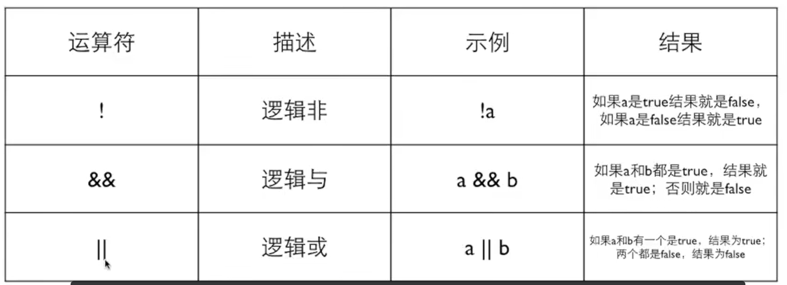
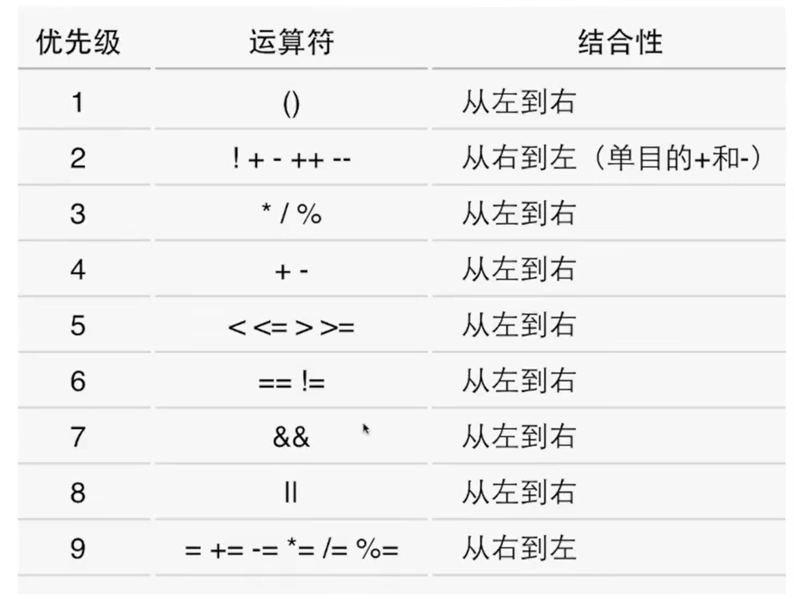

# 第六周：数据类型

## 6.2 其他运算：逻辑、条件、逗号

### 6.2.1

**bool**
- `#include <stdbool.h>`
- 之后就可以使用bool和true、false

### 6.2.2

**逻辑运算**
- 逻辑运算是对逻辑量进行的运算，结果只有0或1
- 逻辑量是关系运算或逻辑运算的结果



如果要表达数学中的区间，应该如何写C的表达式？
- `x>4&&x<6`

如何判断一个字符c是否为大写字母？
- `c>='A'&&c<='Z'`

理解：
- `age>20&&age<30`
age处于20和30中间，并且不包含20和30
- `index<0||index>99`
index不在0~99的范围
- `!age<20`
==注意==：!的优先级会高于<
因此：如果age是0，则!age就是1；如果age不是0，则!age就是0
所以，整个表达式一定是1
- `!(age<20)`
这个才能表示age大于等于20

**优先级**
`!`>`&&`>`||`



**短路**
逻辑运算是从左向右进行的，如果左边的结果已经能够决定结果了，就不会做右边的计算。
- `a==6&&b==1`
- `a==6&&b+=1`

对于`&&`，左边是false时就不做右边了；
对于`||`，左边是true时就不做右边了。

因此，不要把赋值，包括复合赋值组合进表达式！

### 6.2.3

**条件运算符**
```c
count = (count>20)>?count-10:count+10;
```
- 问号前面：条件
- 问号后面冒号前面：条件满足时的值
- 冒号后面：条件不满足时的值

因此，上面的代码相当于：
```c
if (count>20){
    count-=10;
} else {
    count+=10；
}
```

**优先级**
条件运算符的优先级高于赋值运算符，但是低于其他运算符。
- `m<n?x:a+5`
- `a++>=1&&b-->2?a:b`
- `x=3*a>5?5:20`

**嵌套条件表达式**
- `count = (count>20)?(count<50)?count-10:count-5:(count<10)?count+10:count+5;`

条件运算符是自右向左结合的。
总的来说，不要使用嵌套程序表达式。

**逗号运算符**
逗号用来连接两个表达式，并以其右边的表达式的值作为它的结果。
逗号的优先级是所有的运算符中最低的，所以它两边的表达式会先计算；
逗号的组合关系是从左向右的，所以左边的表达式会先计算，而右边的表达式的值就留下来作为逗号运算的结果。
```c
i=3+4,5+6;
```
上面的代码会出问题，因为3+4的结果被赋给了i，赋值的优先级比逗号来得高，5+6的结果没有被用到。
```c
i=(3+4,5+6);
```
这个时候i就会被赋值11，3+4的结果没有被用到。


那么，逗号运算符有什么用呢？
主要是在for中使用：
```c
for (i=0,j=10;i<j;i++,j--) {
    ...
}
```
目前，逗号运算符基本只有这一个用处。
